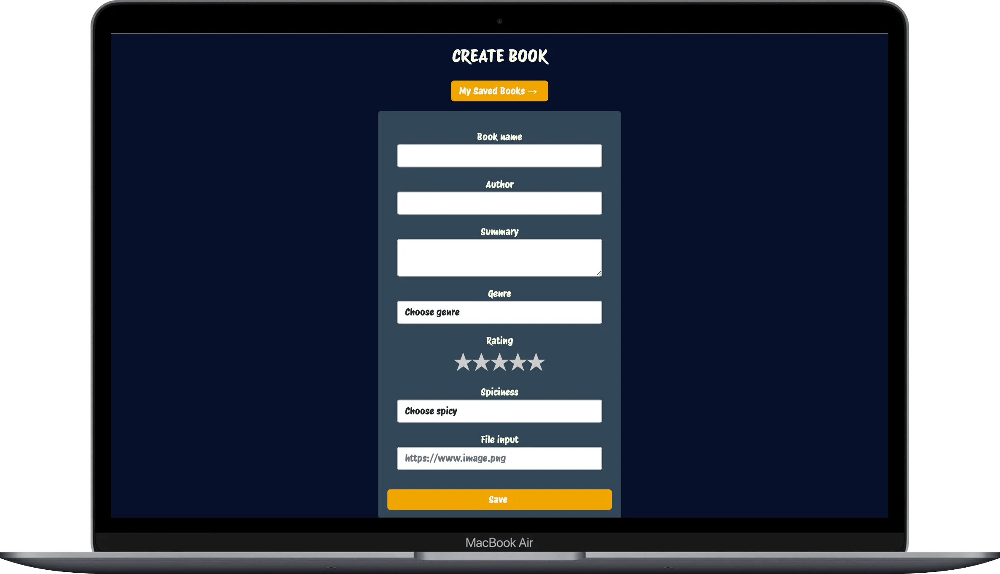

# 📚 Book Tracker App

A fullstack web application built with **React**, **Redux**, **Node.js**, and **MongoDB** that allows users to register, log in, and manage a personalized collection of saved books.

---

## 🚀 Features

- 🔐 User Authentication (Register/Login with JWT)
- 💾 Save books with custom details
- 📖 View and manage your saved books
- 🧠 State Management using Redux
- 🌐 RESTful API built with Express & MongoDB

=## 🛠 Tech Stack

**Frontend**
- React
- Redux Toolkit
- React Router
- Axios
- TailwindCSS / CSS Modules (optional)

**Backend**
- Node.js
- Express.js
- MongoDB + Mongoose
- JSON Web Tokens (JWT)
- bcryptjs
